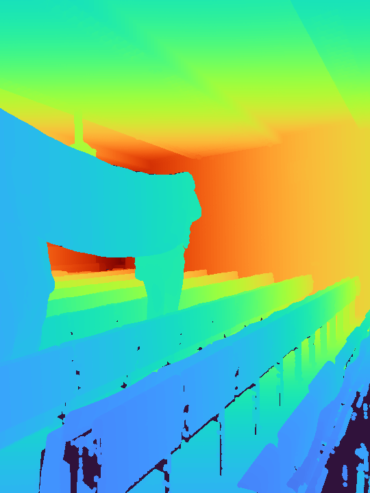
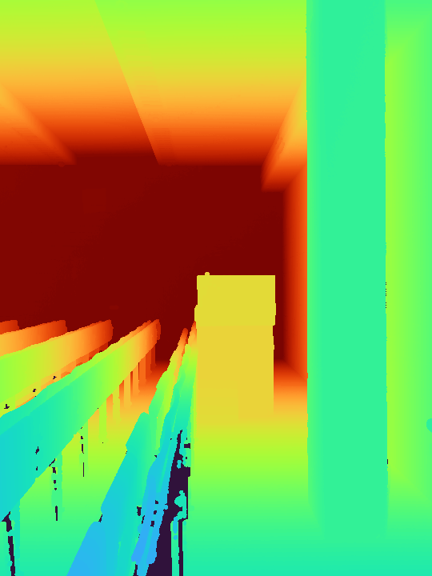

# OakTree
Render large point clouds efficiently using Octrees. The library is a C++ module with Python bindings for ease of use.

## Quick Demo
Create an Octree from a Numpy array containing points' xyz positions and RGB intensities.
```python
import numpy as np
from oaktree import Node

# use random points, but could be any Numpy array with shape [N, 3]
points = np.random.uniform(size=(100000, 3))
points_rgb = points.copy() / np.linalg.norm(points_rgb, axis=1, keepdims=True)
points_rgb = (points_rgb + 1) / 2

# create Octree node that allows efficient ray casting
node = Node(max_points_per_node=1000, points=points, points_rgb=points_rgb)

# camera parameters
image_hw = (640, 480)
K = np.array([[300., 0., 320.],
              [0., 300., 240.],
              [0., 0., 1.]], dtype=np.float64)
cam2world = np.array([[0.707, -0.408, -0.577, 2.0],
                      [-0.707, -0.408, -0.577, 2.0], 
                      [0.0, 0.816, -0.577, 2.0],
                      [0.0, 0.0, 0.0, 1.0]], dtype=np.float64)

# render
rgbd = node.render(K=K, cam2world=cam2world, image_hw=image_hw)
rgb = rgbd[..., :3]
depth = rgbd[..., 3]
```
<p float="left">
  
  
</p>

You can run this and other examples with real datasets with
```bash
cd examples
python box.py
python wurzburg.py
```
Note: examples require extra dependencies including `matplotlib, PIL, pandas`.

[Wurzburg Lecture Hall demo](http://kos.informatik.uni-osnabrueck.de/2Dscans/) output depth maps:
<p float="left">
  
  
</p>

## Installation

### Pypi (linux only)
```bash
pip install pyoaktree
```

### Build from source
Build dependencies:
- CXX compiler compatible with C++17

```bash
git clone --recursive https://github.com/eduardohenriquearnold/oaktree.git
cd oaktree
pip install .
```

Unit tests can be executed with
```bash
mkdir build
cd build
cmake ..
cmake --build .
ctest
# or, to see results of individual tests
./cpp_test
```